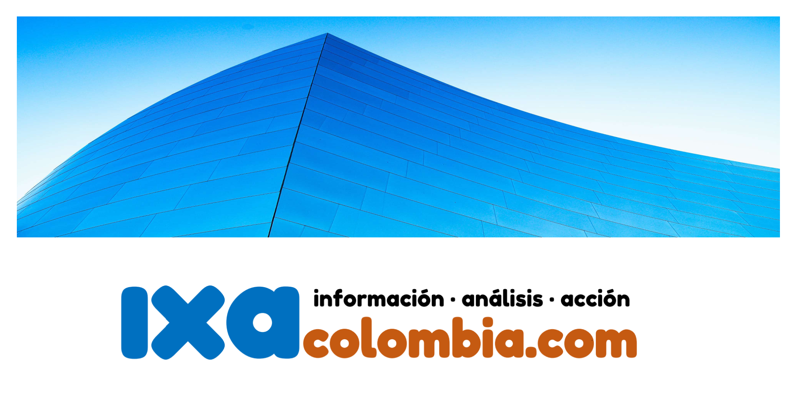
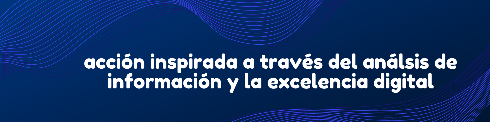
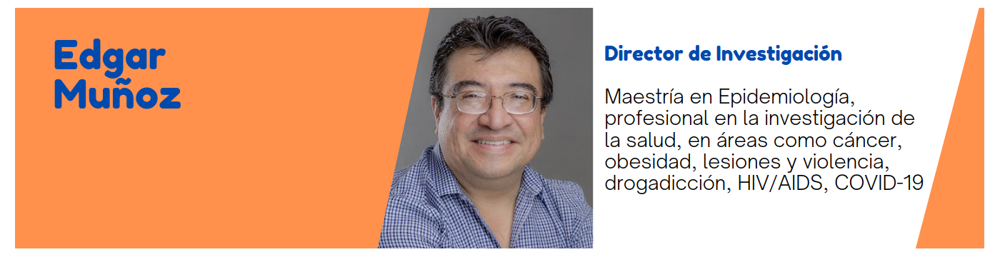
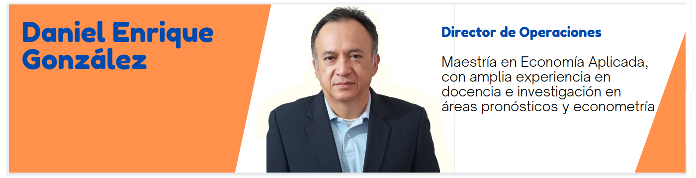
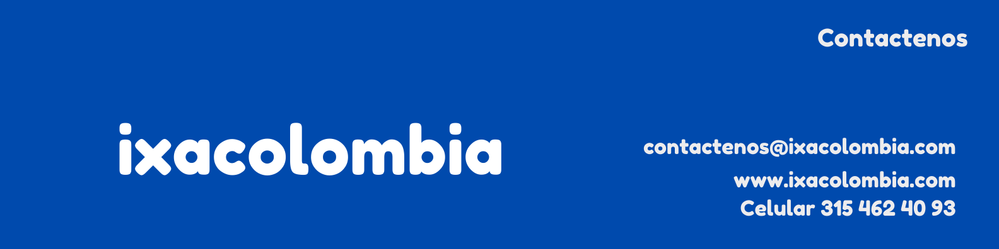

#  **ixaColombia **
{width=80%'}
   

# **Nuestro Equipo**

  
 

  
 

  
 

  

# **Nuestra oferta**
 

+ Identificar oportunidades de negocio y proveer soluciones a la medida
 
+ Creación e implementación de modelos AI Machine Learning / Deep Learning

+ Uso de herramientas analíticas y lenguajes  Python, R, SAS, Stata

+ Aseguramos valor agregado para la entidad, profesionales y usuarios de la salud

    + En el profesional médico, optimiza el tiempo de consulta para dedicarlo a la investigación
    + En la entidad prestadora de servicio, puede ser más eficiente , mejorando el retorno de la inversión y optimitazación los recusos de tiempo
    + En el usuario previene desenlaces catastóficos, mejorando de calidad de vida a tiempo con un diagnóstico más preciso

  

# **Contactos**
  
 

